<div align="center">

# SC2 Meta Analyzer

### Welcome to Your SC2 Meta Analyzer — local, automatic, brutally honest.

`LIVE` &nbsp;•&nbsp; `Built-in Charts` &nbsp;•&nbsp; `Local-First` &nbsp;•&nbsp; `Stream-Ready`

*Track every macro slip across your last 1,000 ladder games.*
*Recognize what your opponent is building before the first scout.*
*See your real progress without manually tagging anything.*

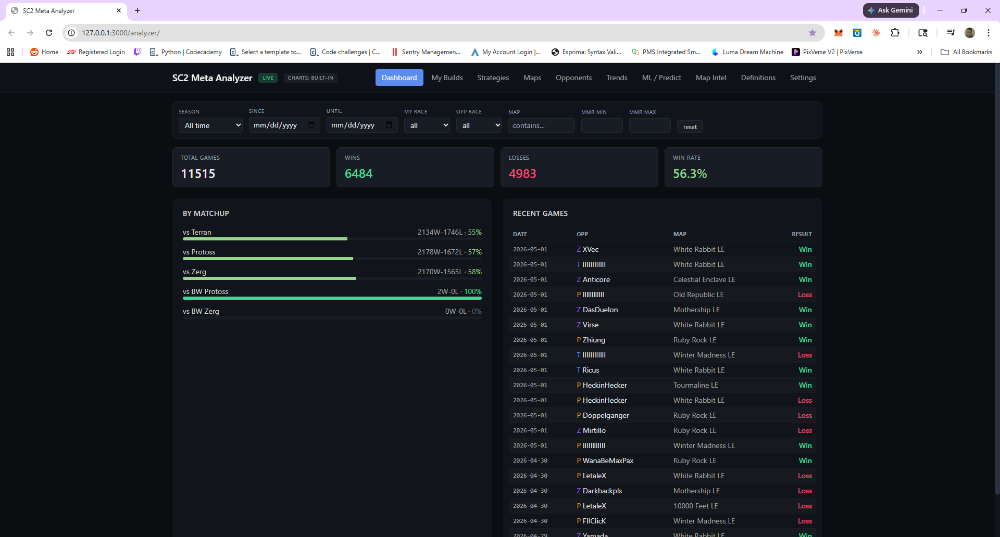

</div>

---

## Table of Contents

1. [What It Does](#what-it-does)
2. [System Architecture](#system-architecture)
3. [Quick Start](#quick-start)
4. [Onboarding Wizard — Step by Step](#onboarding-wizard--step-by-step)
   - [Step 1 — Welcome](#step-1--welcome)
   - [Step 2 — Replays](#step-2--replays)
   - [Step 3 — Identity](#step-3--identity)
   - [Step 4 — Race](#step-4--race)
   - [Step 5 — Import](#step-5--import)
   - [Step 6 — Integrations](#step-6--integrations)
   - [Step 7 — Apply](#step-7--apply)
5. [The Dashboard](#the-dashboard)
6. [My Builds — Macro Breakdown](#my-builds--macro-breakdown)
7. [Opponents — Scouting Database](#opponents--scouting-database)
8. [Strategies, Maps, Trends, ML / Predict](#strategies-maps-trends-ml--predict)
9. [Settings](#settings)
   - [Profile — Connected Battle.net Accounts](#profile--connected-battlenet-accounts)
   - [Replay Folders](#replay-folders)
   - [Import Replays](#import-replays)
   - [Build Classifier](#build-classifier)
   - [Stream Overlay](#stream-overlay)
   - [Voice Readout, Backups, Diagnostics, Privacy, About](#voice-readout-backups-diagnostics-privacy-about)
10. [Stream Overlay Widget Reference](#stream-overlay-widget-reference)
11. [Filter Bar — The Universal Lens](#filter-bar--the-universal-lens)
12. [Data Flow & File Layout](#data-flow--file-layout)
13. [Troubleshooting](#troubleshooting)
14. [Privacy](#privacy)
15. [FAQ](#faq)
16. [License](#license)

---

## What It Does

SC2 Meta Analyzer ingests your StarCraft II replay folder, classifies every game by build, race, map, and outcome, and turns the result into a coaching tool. It runs entirely on your machine at `localhost:3000/analyzer/` — no account, no upload, no cloud.

| Capability | What you get |
| --- | --- |
| **Macro tracking** | Total games, W/L, win-rate by matchup, MMR delta, recent games feed. |
| **Build recognition** | Auto-classified openers (PvZ Carrier Rush, PvT Phoenix into Robo, etc.) with per-build win rates. |
| **Opponent intel** | Permanent record of every player you've faced — keyed to their SC2Pulse ID, not their name change. |
| **Map intel** | Win rates and build performance per map. |
| **Predictions** | ML / Predict tab that calls likely opponent builds and your best counter. |
| **Stream overlays** | 15 ready-to-paste OBS / Streamlabs browser sources, four pinned as Recommended. |
| **Voice readout** | Optional in-ear scouting report when a game starts. |

---

## System Architecture

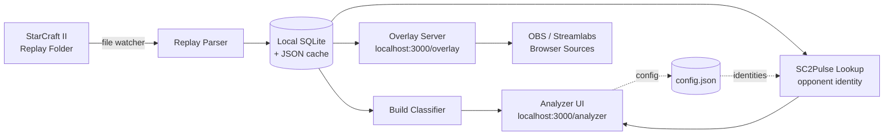

Two surfaces are served from the same backend:

- **`/analyzer/`** — the dashboard you read between games.
- **`/overlay/widgets/*.html`** — the live HUD your stream sees.

Both pull from the same local store, so what your viewers see and what you analyze can never drift apart.

---

## Quick Start

```text
1. Launch the app  ──►  open http://localhost:3000/analyzer/
2. Click "Get started" on the Welcome screen
3. Confirm your replay folder
4. Verify your Battle.net identity (auto-detected)
5. Pick your race
6. Wait for the import bar to finish
7. Done — Dashboard goes LIVE
```

The whole onboarding flow takes about 60 seconds for a 1,000-game library.

---

## Onboarding Wizard — Step by Step

The wizard has seven tabs across the top. The current step is highlighted **blue**, completed steps turn **green**, and you can jump backward at any time.

```
┌──────────┬──────────┬───────────┬─────────┬──────────┬────────────────┬─────────┐
│ 1.Welcome│ 2.Replays│ 3.Identity│ 4. Race │ 5. Import│ 6. Integrations│ 7. Apply│
└──────────┴──────────┴───────────┴─────────┴──────────┴────────────────┴─────────┘
```

### Step 1 — Welcome

<p align="center">
  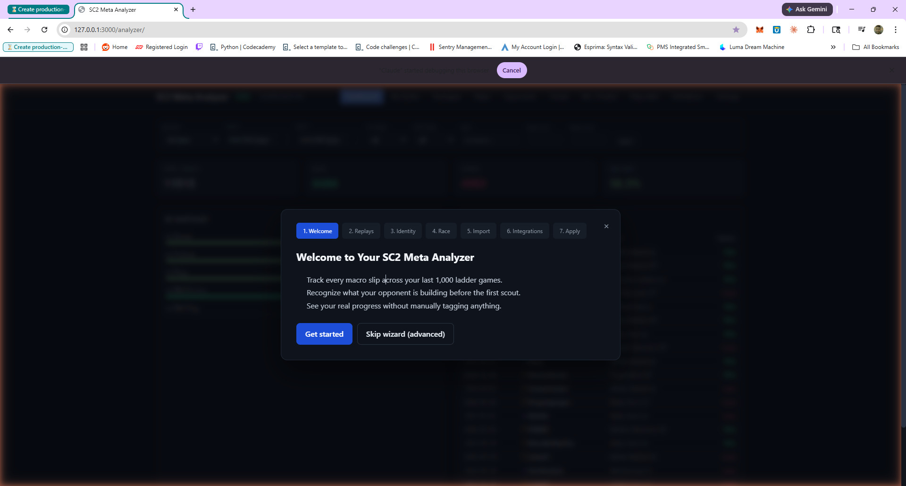
</p>

The opening card reads **"Welcome to Your SC2 Meta Analyzer"** and states the three promises of the tool:

- Track every macro slip across your last 1,000 ladder games.
- Recognize what your opponent is building before the first scout.
- See your real progress without manually tagging anything.

**Two buttons:**

| Button | When to use it |
| --- | --- |
| **Get started** | First-time setup. Walks you through every step. Recommended. |
| **Skip wizard (advanced)** | You've used the tool before, your `config.json` is already populated, and you just want the dashboard. |

> **Tip** — Even if you skip the wizard, you can re-run any step from **Settings** later. Nothing is one-shot.

### Step 2 — Replays

<p align="center">
  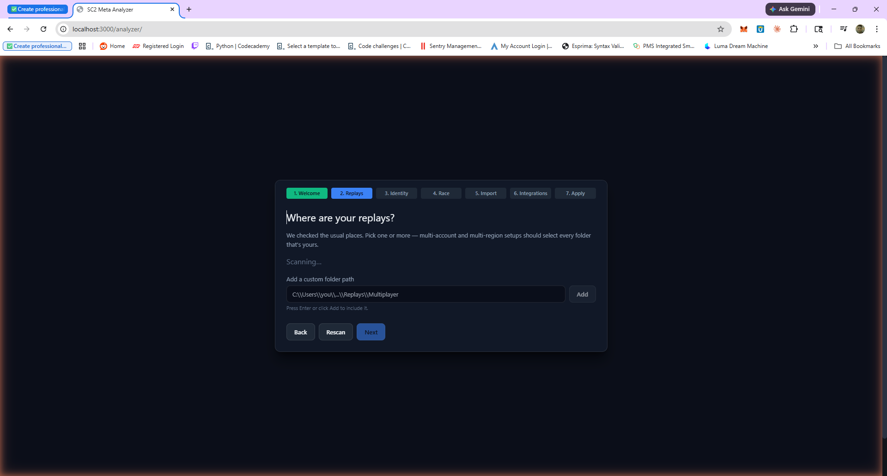
</p>

> *"Where are your replays?"*

The app auto-scans the standard StarCraft II install paths on your OS. While it scans, you'll see a `Scanning…` indicator. Multi-account and multi-region players should add **every** folder that contains their replays.

**Default paths checked automatically:**

| OS | Path |
| --- | --- |
| Windows | `C:\Users\<you>\Documents\StarCraft II\Accounts\<acct>\<region>\Replays\Multiplayer` |
| macOS | `~/Library/Application Support/Blizzard/StarCraft II/Accounts/<acct>/<region>/Replays/Multiplayer` |
| Linux (Wine/Lutris) | `~/.wine/drive_c/users/<you>/Documents/StarCraft II/...` |

**Add a custom folder path** — paste any extra directory (a backup drive, a teammate's archive, an external SSD) into the input and press **Enter** or click **Add**. The placeholder shows the expected shape: `C:\Users\you\...\Replays\Multiplayer`.

**Buttons on this screen:**

- **Back** — return to Welcome.
- **Rescan** — re-run the auto-detector after plugging in a drive.
- **Next** — proceed once at least one folder is selected.

### Step 3 — Identity

The wizard inspects the most recent replay and pre-fills your **in-replay name**, **regional profile / replay-folder ID**, **Battle.net account number**, and **SC2Pulse character ID**. You confirm or edit each one. BattleTag (`Name#1234`) is the one field it cannot detect — type it in once.

You can add a second, third, or fourth identity here (one per region you ladder on). Each identity is stored as an entry in `config.identities[]`.

### Step 4 — Race

Pick **Protoss / Terran / Zerg / Random**. This is used as the default `MY RACE` filter on every page — you can still flip it per-view from the filter bar.

### Step 5 — Import

The classifier runs through every replay it found, pulls out:

- Map, duration, MMR before/after, race matchup, win/loss
- The first ~3 minutes of build order → matched against the build library
- Opponent's in-replay name and SC2Pulse ID (looked up via `sc2pulse.nephest.com`)

A progress bar shows X of Y replays processed. A 1,000-game library imports in roughly 30–90 seconds depending on disk speed.

### Step 6 — Integrations

Optional plug-ins:

| Integration | Purpose |
| --- | --- |
| **SC2Pulse** | Already wired — supplies the persistent opponent IDs. |
| **OBS / Streamlabs** | Provides the browser-source URLs for the overlay widgets. |
| **Voice readout** | Pipes the scouting report through your default audio device. |

### Step 7 — Apply

Final review screen. Click **Apply** to write `config.json`, kick off the watcher service, and route you to the live Dashboard. The header now shows the green **LIVE** pill — meaning the file watcher is active and any new replay you finish will appear within seconds.

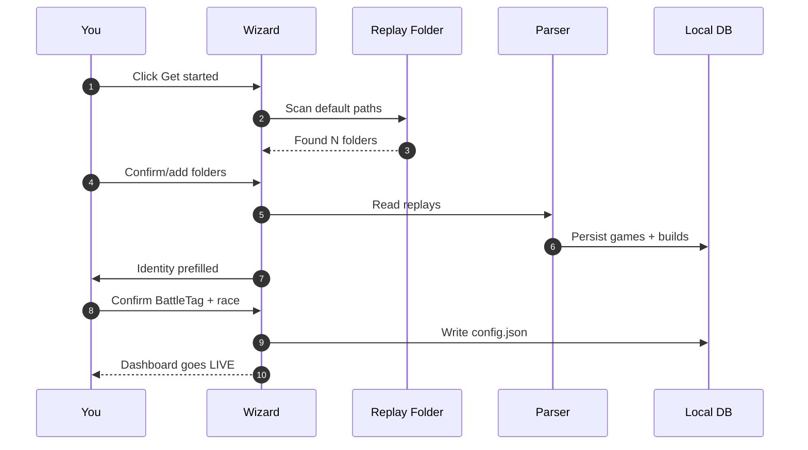

---

## The Dashboard

<p align="center">
  
</p>

The Dashboard is the room you live in between matches.

**Header (always visible):**

```
SC2 Meta Analyzer  [LIVE]  CHARTS: BUILT-IN
─────────────────────────────────────────────────────
Dashboard │ My Builds │ Strategies │ Maps │ Opponents │ Trends │ ML / Predict │ Map Intel │ Definitions │ Settings
```

**Filter bar** sits directly under the header on every page — see [Filter Bar](#filter-bar--the-universal-lens).

**The four KPI cards:**

| Card | Reads |
| --- | --- |
| **Total Games** | All games matching the current filter. |
| **Wins** | Green count. |
| **Losses** | Red count. |
| **Win Rate** | Percentage. Color-graded — green ≥ 55%, yellow 45–54%, red < 45%. |

**By Matchup panel** — horizontal bars for `vs Terran`, `vs Protoss`, `vs Zerg`, plus rare matchups (`vs BW Protoss`, `vs BW Zerg`) when present. Each bar shows record and percent. Bar color tracks win rate.

**Recent Games panel** — the last ~25 games. Columns:

| Column | Meaning |
| --- | --- |
| **Date** | YYYY-MM-DD of the game. |
| **OPP** | Opponent's in-replay name, prefixed with a race letter ( **P** Protoss, **T** Terran, **Z** Zerg ). Players who haven't typed a name show as `IIIIIIIII`. |
| **Map** | Ladder map name. |
| **Result** | Green **Win** / red **Loss**. |

Click any row to drill into the full replay deep-dive (timeline, build order, MMR delta, opponent profile).

---

## My Builds — Macro Breakdown

<p align="center">
  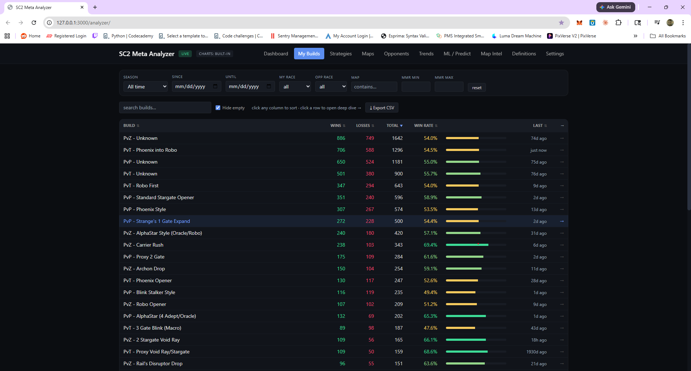
</p>

This is where you find out *what is actually working*. The classifier groups every game by the opener you played and reports the empirical W / L / total / win-rate for each one.

**Header controls on the page:**

- `search builds…` — type-ahead filter (matches build name).
- ☑ **Hide empty** — collapse builds with zero games in the current filter window.
- **Export CSV** — dump the visible table to disk.
- *Click any column to sort. Click a row to open the deep dive.*

**Columns:**

| Column | Meaning |
| --- | --- |
| **BUILD** | Matchup prefix + opener name (e.g. `PvP – Standard Stargate Opener`). |
| **WINS** | Green count. |
| **LOSSES** | Red count. |
| **TOTAL** | Sample size — sort by this to filter out noise. |
| **WIN RATE** | Percentage. The bar to the right is color-graded for at-a-glance scanning. |
| **LAST** | Time since you last played this build (`just now`, `2d ago`, `74d ago`, …). |

### How to read it

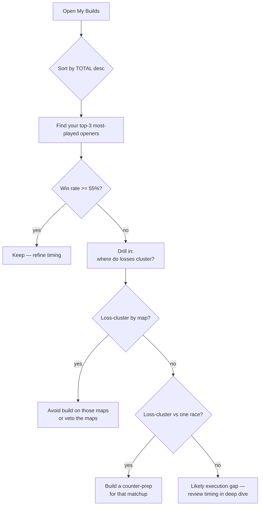

### Reading the row colors

The win-rate bar tells you the verdict in one glance:

| Bar color | Win rate | Verdict |
| --- | --- | --- |
| Bright green | >= 65% | Smashing it. Don't change a thing. |
| Green | 55–64% | Solid. Keep playing. |
| Yellow | 45–54% | Coin flip. Either refine or drop it. |
| Orange / red | < 45% | Bleeding MMR. Stop or fix the timing. |

### Drill-down

Clicking a row opens the build deep-dive:

- **Per-map** breakdown of the same build.
- **Per-opponent-race** breakdown.
- **MMR-bucket** breakdown (does it work below 4k but die at 5k?).
- **Sample game list** — every replay in that bucket, click-through to timeline.
- **Suggested follow-ups** — what the classifier thinks you transition into and how those branches perform.

---

## Opponents — Scouting Database

<p align="center">
  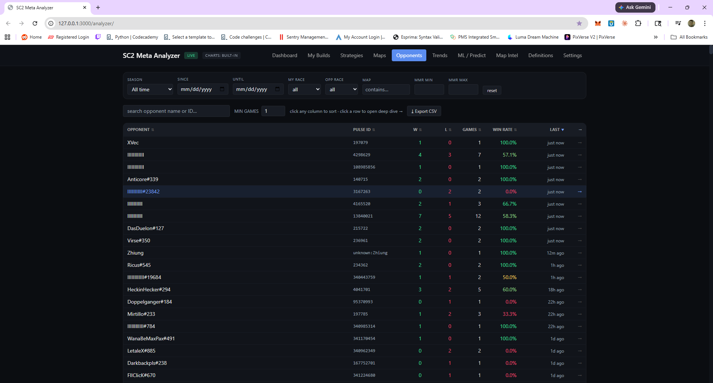
</p>

Every player you have ever faced, keyed to their SC2Pulse numeric ID so name changes don't break your history.

**Page controls:**

- `search opponent name or ID…`
- **MIN GAMES** — hide opponents you've only played once (default 1).
- **Export CSV**.

**Columns:**

| Column | Meaning |
| --- | --- |
| **OPPONENT** | In-replay name `#discriminator`. |
| **PULSE ID** | Numeric SC2Pulse character ID. The stable identifier. |
| **W** | Wins against them. |
| **L** | Losses. |
| **GAMES** | Total games. |
| **WIN RATE** | Lifetime W% against this player. |
| **LAST** | Time since the last meeting. |

Clicking a row opens an **opponent dossier**: every game you've played against them, their typical build choices versus you, their preferred maps, and whether they cheese on first encounters. Use this 20 seconds before a rematch.

> **Why the Pulse ID matters** — players rename constantly. The Pulse ID never changes. Two players sharing the same blank in-replay name are easy to tell apart — the IDs are different.

---

## Strategies, Maps, Trends, ML / Predict

These tabs reuse the same data lens but slice it differently:

| Tab | Question it answers |
| --- | --- |
| **Strategies** | Which transitions / mid-game compositions follow each opener, and how do they perform? |
| **Maps** | Per-map W-L, plus which builds work best on which map. Use it to plan vetoes. |
| **Trends** | Time-series of MMR, win rate, build mix. Catch a decline before it costs you a league. |
| **ML / Predict** | Given the opening cues from the live game, predict the opponent's likely build path and propose your best historical counter. |
| **Map Intel** | Static map-pool reference — main / nat / third positions, key timings, scouting routes. |
| **Definitions** | Glossary of every classifier label — what counts as `PvZ – Carrier Rush` vs `PvZ – 2 Stargate Void Ray`. |

---

## Settings

The Settings page hosts ten sub-pages on the left rail. Every change saves to `config.json` on click.

```
Settings
├── Profile               ← Battle.net identities
├── Replay folders        ← add/remove watched directories
├── Import replays        ← manual / bulk reimport
├── Build classifier      ← tune build-rule thresholds
├── Stream overlay        ← OBS / Streamlabs widget URLs
├── Voice readout         ← TTS scouting report
├── Backups               ← snapshot / restore the local DB
├── Diagnostics           ← logs, parser version, health checks
├── Privacy               ← what leaves the machine (almost nothing)
└── About                 ← version, changelog, credits
```

### Profile — Connected Battle.net Accounts

<p align="center">
  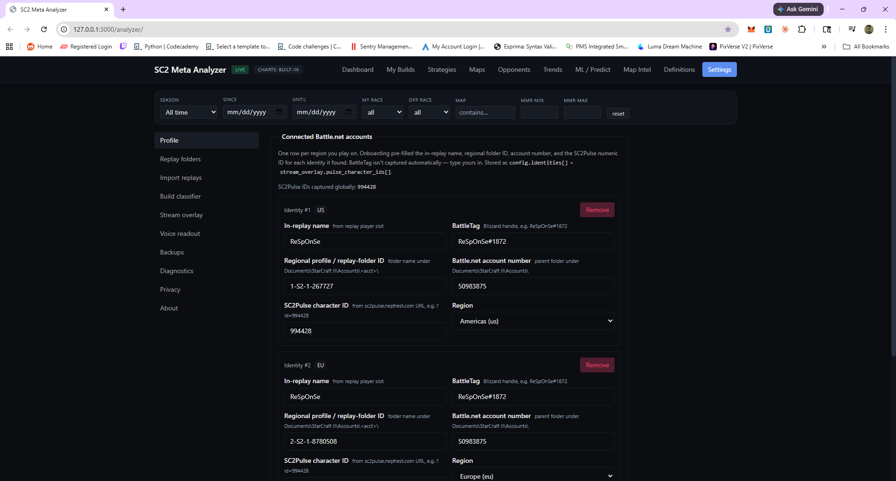
</p>

One identity card per region you play on. The wizard pre-fills almost everything; this is where you adjust later.

**Fields per identity:**

| Field | Source |
| --- | --- |
| **In-replay name** | Auto-detected from the most recent replay's player slot. |
| **BattleTag** *(e.g. `ReSpOnSe#1872`)* | Manual — the only field not auto-captured. |
| **Regional profile / replay-folder ID** | Folder name under `Documents\StarCraft II\Accounts\<acct>\` (e.g. `1-S2-1-267727`). |
| **Battle.net account number** | Parent folder under `Documents\StarCraft II\Accounts\` (e.g. `50983875`). |
| **SC2Pulse character ID** | From `sc2pulse.nephest.com` URL (e.g. `?id=994428`). |
| **Region** | `Americas (us)`, `Europe (eu)`, `Korea (kr)`, `China (cn)`. |

Settings stores these as `config.identities[]` and mirrors them into `stream_overlay.pulse_character_ids[]`, so your overlays follow you across regions.

The Settings page header reports a global counter — `SC2Pulse IDs captured globally: 994428` — confirming the lookup service is reachable.

**Add another region** — click the green button at the top of the list (visible after the last identity).
**Remove a region** — red **Remove** button on each card.

> **Tip** — If your replay names show as a row of vertical bars, that's because your Battle.net display name was empty at the time. Fixing it in-game and replaying one ladder match will repopulate the identity card.

### Replay Folders

Add, remove, or temporarily disable any folder. Each row shows the path, file count, and last-scanned timestamp. Click **Rescan** to force a re-walk after moving files.

### Import Replays

Manual control of the parser:

- **Import a single file** — drag-drop or browse.
- **Reimport all** — wipes the parsed cache and rebuilds. Use after a classifier update.
- **Reimport range** — by date, MMR, or matchup. Useful for testing a new build rule.

### Build Classifier

Per-rule thresholds (e.g. *"call it Phoenix Style if 2+ Phoenix produced before 5:00"*). Comes pre-loaded with sensible defaults; advanced users can tune.

### Stream Overlay

See the dedicated [Stream Overlay Widget Reference](#stream-overlay-widget-reference) below — this is its own section because there's a lot of it.

### Voice Readout, Backups, Diagnostics, Privacy, About

| Page | What's there |
| --- | --- |
| **Voice readout** | Toggle TTS, pick voice, set volume, choose which moments speak (game start / win / loss / streak). |
| **Backups** | One-click snapshot of `analyzer.db` and `config.json`. Auto-rotation. Restore any snapshot. |
| **Diagnostics** | Watcher status, parser version, classifier version, last error log, "Copy diagnostic bundle" button for support. |
| **Privacy** | Confirms what is local-only and lists the exactly-two outbound calls (SC2Pulse opponent lookup, optional update check). Both can be disabled. |
| **About** | Version number, changelog link, credits, license. |

---

## Stream Overlay Widget Reference

<p align="center">
  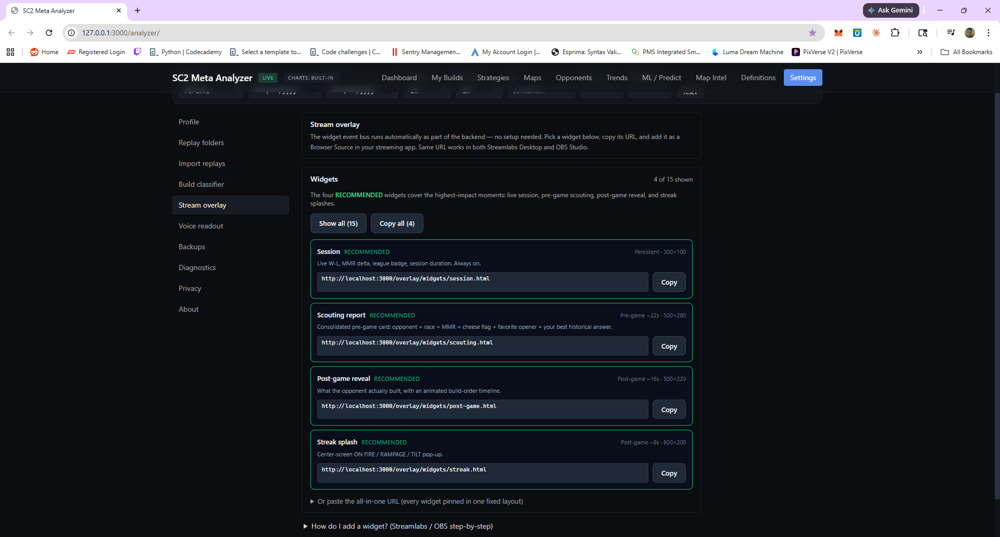
</p>

> **The widget event bus runs automatically as part of the backend — no setup needed.** Pick a widget, copy its URL, and add it as a Browser Source in your streaming app. The same URL works in **Streamlabs Desktop** and **OBS Studio**.

The overlay panel shows **4 of 15** widgets by default — the four marked **RECOMMENDED** because they cover the highest-impact moments: live session, pre-game scouting, post-game reveal, and streak splashes. Use **Show all (15)** to expand, or **Copy all (4)** to grab the recommended set in one click.

### The four recommended widgets

| Widget | Purpose | Trigger | Default size | URL |
| --- | --- | --- | --- | --- |
| **Session** `RECOMMENDED` | Live W-L, MMR delta, league badge, session duration. **Always on.** | Persistent | 300×100 | `http://localhost:3000/overlay/widgets/session.html` |
| **Scouting report** `RECOMMENDED` | Consolidated pre-game card: opponent + race + MMR + cheese flag + favorite opener + your best historical answer. | Pre-game ~22 s | 500×280 | `http://localhost:3000/overlay/widgets/scouting.html` |
| **Post-game reveal** `RECOMMENDED` | What the opponent actually built, with an animated build-order timeline. | Post-game ~16 s | 500×220 | `http://localhost:3000/overlay/widgets/post-game.html` |
| **Streak splash** `RECOMMENDED` | Center-screen ON FIRE / RAMPAGE / TILT pop-up. | Post-game ~8 s | 600×200 | `http://localhost:3000/overlay/widgets/streak.html` |

Each row in the panel has a **Copy** button that puts the URL on your clipboard.

### Adding a widget to OBS / Streamlabs

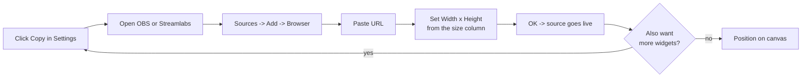

**Step-by-step in OBS Studio:**

1. In Settings → Stream overlay, click **Copy** next to the widget you want.
2. In OBS, in the **Sources** panel, click **+** → **Browser**.
3. Name it (e.g. `SC2 Session`) → **OK**.
4. Paste the URL into the **URL** field.
5. Set **Width** and **Height** to the values listed in the Settings card (e.g. `300 × 100` for Session).
6. Leave **Custom CSS** blank — the widget already styles itself with a transparent background.
7. Tick **"Shutdown source when not visible"** if you want zero CPU when the scene is hidden.
8. Click **OK** and position the source on your canvas.

**Streamlabs Desktop** is identical except the source is called **"Browser Source"** under **Add Source**.

### The all-in-one URL

If you'd rather paste a single URL that contains every widget pinned in one fixed layout (good for dual-monitor setups where the overlay lives on a secondary display), expand **"Or paste the all-in-one URL (every widget pinned in one fixed layout)"** at the bottom of the Stream overlay page.

### The full 15

Click **Show all (15)** to reveal the additional eleven widgets — things like *Race scoreboard*, *Map veto card*, *Build classifier ribbon*, *MMR sparkline*, *PR badge*. Each follows the same Copy-paste pattern.

---

## Filter Bar — The Universal Lens

The filter strip directly under the header is the same on every page. Set it once and the entire UI re-renders against that slice of your data.

| Filter | Notes |
| --- | --- |
| **SEASON** | `All time` or any past ladder season. |
| **SINCE / UNTIL** | Free date range (`mm/dd/yyyy`). |
| **MY RACE** | `all`, `Protoss`, `Terran`, `Zerg`, `Random`. |
| **OPP RACE** | Same options. |
| **MAP** | `contains…` substring search. |
| **MMR MIN / MMR MAX** | Inclusive bounds. Use to study how a build performs against your peer bracket. |
| **reset** | Wipes every filter back to defaults. |

Filters persist while you navigate between tabs. When you Export CSV, only filtered rows are exported.

---

## Data Flow & File Layout

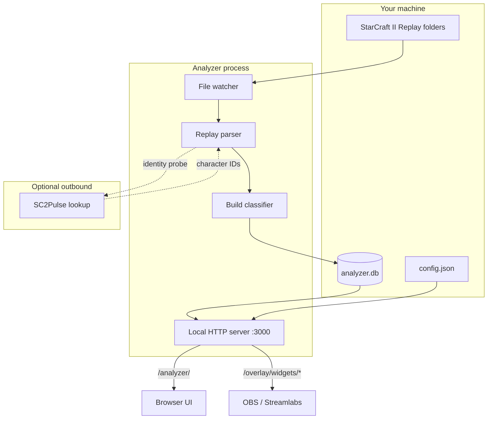

**Key files** (paths shown for Windows; equivalents on macOS/Linux):

| File | Role |
| --- | --- |
| `%APPDATA%\sc2-meta-analyzer\config.json` | Identities, folders, classifier thresholds, overlay choices. |
| `%APPDATA%\sc2-meta-analyzer\analyzer.db` | Parsed games, builds, opponent index. |
| `%APPDATA%\sc2-meta-analyzer\backups\*.zip` | Auto-rotated snapshots. |
| `%APPDATA%\sc2-meta-analyzer\logs\*.log` | Parser + watcher logs (rolled daily). |

---

## Troubleshooting

| Symptom | Likely cause | Fix |
| --- | --- | --- |
| `LIVE` pill is grey | File watcher stopped. | Settings → Diagnostics → **Restart watcher**. |
| New games not appearing | Replay folder not in the watch list. | Settings → **Replay folders** → Add folder → Rescan. |
| Opponent shows as a row of bars | Player had an empty in-replay display name. Pulse ID is still recorded. | Nothing to fix — sort by Pulse ID instead of name. |
| Overlay widget is blank in OBS | Browser source URL typo, or OBS cached old version. | Right-click source → **Refresh cache of current page**. |
| Build classifier mislabeled a game | Classifier thresholds disagree with that game. | Settings → **Build classifier** → adjust the rule, then Reimport. |
| `SC2Pulse IDs captured globally` shows `0` | No internet, or SC2Pulse down. | Try later; offline analysis still works, opponent IDs simply won't be enriched. |
| MMR delta wrong on the last game | Bnet hadn't reported the post-game MMR yet when parsed. | Reimport that single replay from Settings → **Import replays**. |

---

## Privacy

- **Replays are read locally.** Nothing is uploaded.
- **Your config never leaves your machine.**
- **The only outbound calls** are (a) SC2Pulse opponent identity lookups, and (b) an optional update check. Both can be disabled in Settings → **Privacy**.
- **Stream overlays** are served from `localhost` — your viewers see *rendered HTML*, never your underlying data files.

---

## FAQ

**Can I run this on a server / VPS so my whole team can use it?**
The intended deployment is local-only. You can technically point OBS on another machine at your overlay URL over LAN, but the analyzer UI is single-user.

**Does the classifier work for Brood War replays?**
The schema includes `vs BW Protoss` / `vs BW Zerg` matchup buckets for completeness, but the production classifier is tuned for SC2: WoL/HotS/LotV/co-op-disabled ladder.

**Why is my win rate different from the in-game ladder client?**
The in-game client only counts the current season. Set the SEASON filter to the current season to match it; `All time` shows your career.

**Will renaming break my history?**
No. History is keyed to your SC2Pulse character ID, not your in-replay name.

**Where do I get my SC2Pulse character ID?**
Open your profile on `sc2pulse.nephest.com` — the URL ends in `?id=NNNNNN`. The wizard usually fills this for you.

---

## Screenshot Asset Checklist

The README references seven images under `docs/images/`. Save your screenshots with these exact filenames so the markdown picks them up automatically:

| Filename | Source screenshot |
| --- | --- |
| `docs/images/01-welcome.png` | Onboarding wizard — *Welcome to Your SC2 Meta Analyzer* |
| `docs/images/02-replays.png` | Onboarding wizard — *Where are your replays?* |
| `docs/images/03-dashboard.png` | Dashboard — KPI cards, By Matchup, Recent Games |
| `docs/images/04-my-builds.png` | My Builds — per-opener W/L table |
| `docs/images/05-opponents.png` | Opponents — searchable scouting database |
| `docs/images/06-settings-profile.png` | Settings — Connected Battle.net accounts |
| `docs/images/07-settings-stream-overlay.png` | Settings — Stream overlay widgets |

The `docs/images/` folder has already been created. Drop the seven PNGs in and the README renders end-to-end.

---

## License

SC2 Meta Analyzer is distributed under the terms in `LICENSE`. Replay parsing leverages publicly documented Blizzard `.SC2Replay` formats; opponent enrichment uses the SC2Pulse public API under their fair-use policy.

<div align="center">

— *Stop guessing what works. Start knowing.* —

</div>
