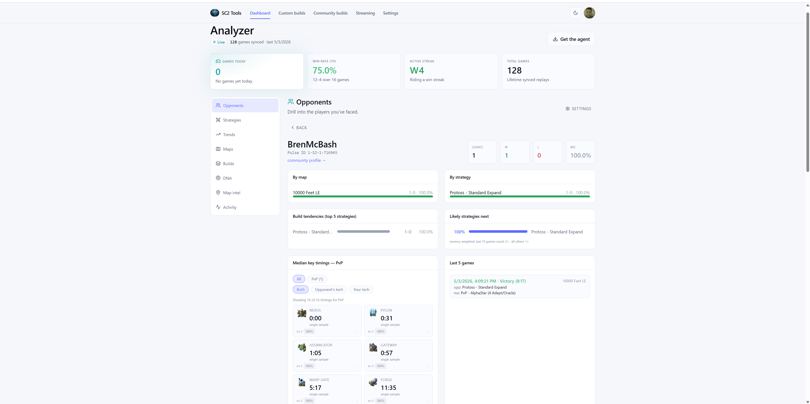
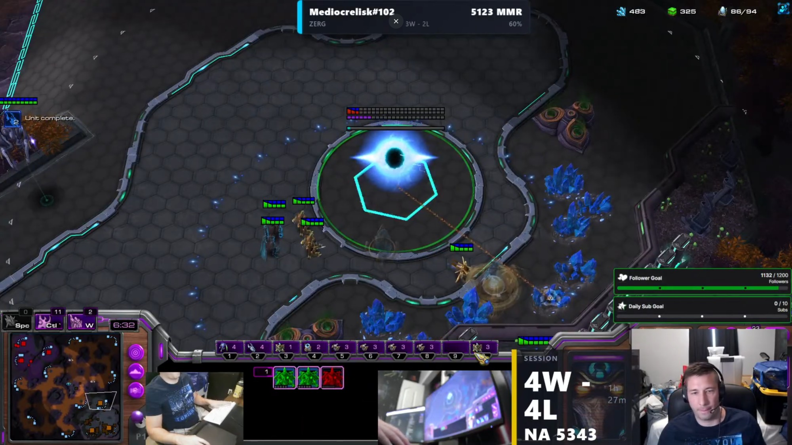
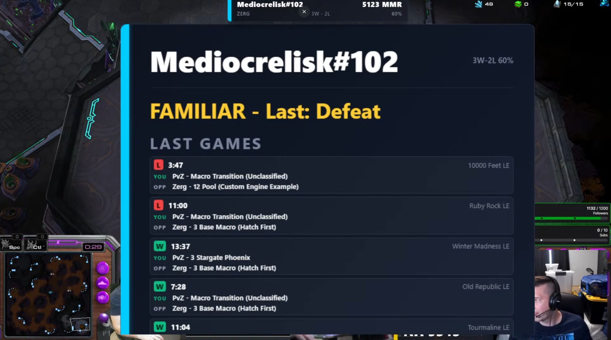
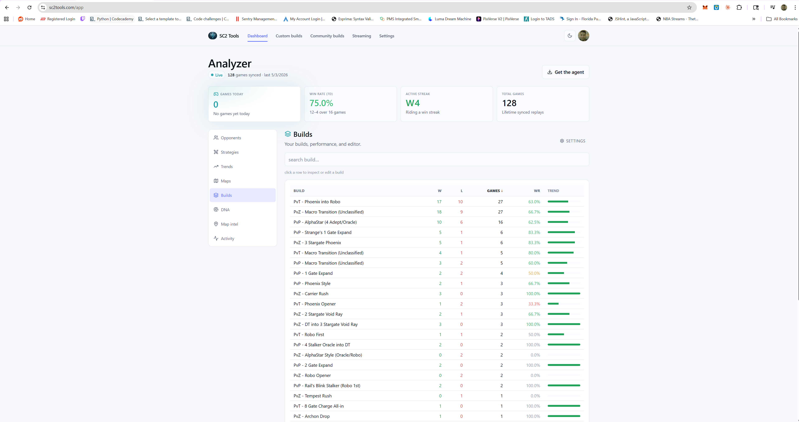
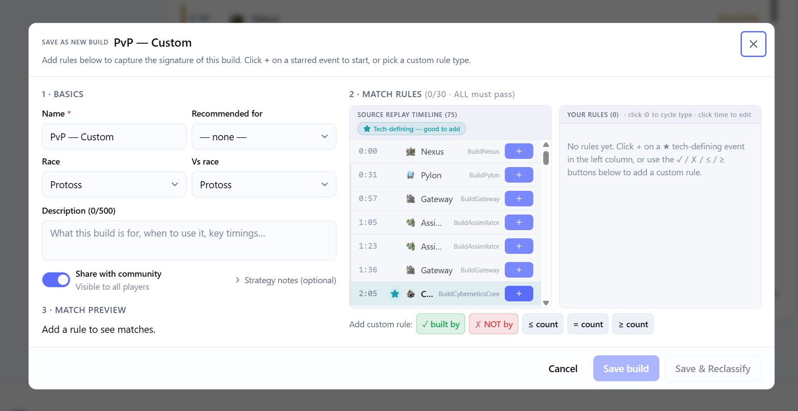

<div align="center">

# SC2 Tools

### Your opponent's build, before they build it.

Opponent intel, automatic build-order analytics, and a live OBS overlay for StarCraft II —
synced across every device from **[sc2tools.com](https://sc2tools.com)**.

`Free desktop` · `Cross-device cloud` · `OBS overlay ready` · `GDPR`



</div>

---

## What it is

SC2 Tools watches your StarCraft II replay folder, parses every game the moment it finishes,
and turns it into analytics you actually use: a permanent dossier on every opponent you face,
win-rates for each of your build orders, and a broadcast-ready overlay for stream day. You sign
in on the web, install a lightweight desktop agent once, and everything stays in sync — laptop,
desktop, and stream PC.

It's a cloud product: a Next.js web app, an Express + MongoDB API, and a small Python desktop
agent that does the local replay parsing.

## Seven pillars, one workflow

| | |
|---|---|
| **Opponent Intel** | A permanent record of every player you've faced — keyed to their persistent SC2Pulse ID, so a name change never breaks your history. |
| **Auto Replay Classification** | Every replay parsed in seconds and sorted into your build library. No manual tagging. |
| **Build Recognizer** | Per-opener W-L with map and MMR breakdowns, and trend sparklines. |
| **Strategy Detection** | Rule-based opener identification across 100+ builds, per matchup. |
| **Map Intel & Veto Planning** | Per-map win-rates and timing libraries to plan your veto. |
| **Live OBS Overlay** | 15 broadcast-ready widgets behind per-widget URLs — drop one into a Browser Source and you're streaming. |
| **Custom Build Library** | Sync your own openers and browse the community pool. |

There's also an **Arcade**: lightweight daily games (Buildle and friends) generated from *your own*
replay data — a fun way to revisit your games.

## Screens

> Real captures from the live app.

**Live OBS overlay — copy & paste.** 15 widgets behind one URL; drop it into a Browser Source and you're on the air.



**Familiar-opponent flags, on stream.** Run-it-back? The overlay calls out repeats with the last result and head-to-head record.



**Build classifier — no tagging.** Every replay auto-classified; win-rate per opener, per matchup, per map.



**Save any replay as a custom build.** Open a game, click *Save as new build*, and promote starred events into rules — your library reclassifies in place.



## How it works

1. **Install the agent.** Download the installer and pair it with your account in about 90 seconds.
2. **Play normally.** Every replay you finish parses and uploads in the background — no tagging, no manual import.
3. **Light it up.** Your dashboard updates between games, and your overlay URL is ready to drop into OBS.

## Repository layout

```
apps/
  web/      Next.js front-end (Vercel) — sc2tools.com
  api/      Express + MongoDB back-end (Render, Dockerized)
  agent/    Python desktop agent — replay watcher + uploader
cloud/
  community-builds/   community build submission + voting service
docs/       architecture decision records and guides
```

The replay-parsing engine (built on **sc2reader**) and the community-builds service round out the
stack. The web app is auth-gated with [Clerk](https://clerk.com); opponent identity and ladder MMR
come from [SC2Pulse](https://sc2pulse.nephest.com).

## Local development

Each app is self-contained. For the web front-end:

```bash
cd apps/web
cp .env.example .env.local   # fill in Clerk keys + NEXT_PUBLIC_API_BASE
npm install
npm run dev                  # http://localhost:3000
npm run lint && npm run typecheck
```

The API (`apps/api`) and agent (`apps/agent`) have their own `.env.example` and READMEs.

### Running the replay-engine tests

The parser depends on `sc2reader`, whose `mpyq` dependency **fails to build against Debian/Ubuntu's
patched system setuptools** (`AttributeError: install_layout`). Always install into a clean
virtualenv, which uses PyPI's setuptools:

```bash
python3 -m venv .venv
.venv/bin/pip install --upgrade pip setuptools wheel
.venv/bin/pip install sc2reader==1.8.0 numpy==2.1.3 pytest
.venv/bin/python -m pytest <replay-engine>/tests/   # expect 99 passed, 1 skipped
```

Never `pip install sc2reader` into the system Python — that triggers the build failure above.

## Credits & acknowledgements

SC2 Tools stands on the shoulders of two community projects, and would not exist without them:

- **[sc2reader](https://github.com/ggtracker/sc2reader)** — the library that parses Blizzard's
  `.SC2Replay` binary format. It is the engine behind every build order, timing, and macro stat
  in this app. Huge thanks to its authors and maintainers.
- **[SC2Pulse](https://sc2pulse.nephest.com)** (by [nephest](https://github.com/nephest)) — the
  open StarCraft II ladder database that supplies persistent opponent identities and ladder MMR.
  The reason your opponent history survives name changes.

Please consider supporting both projects.

*StarCraft® II is a trademark of Blizzard Entertainment, Inc. SC2 Tools is an independent,
community-built project and is not affiliated with, endorsed by, or sponsored by Blizzard
Entertainment.*
